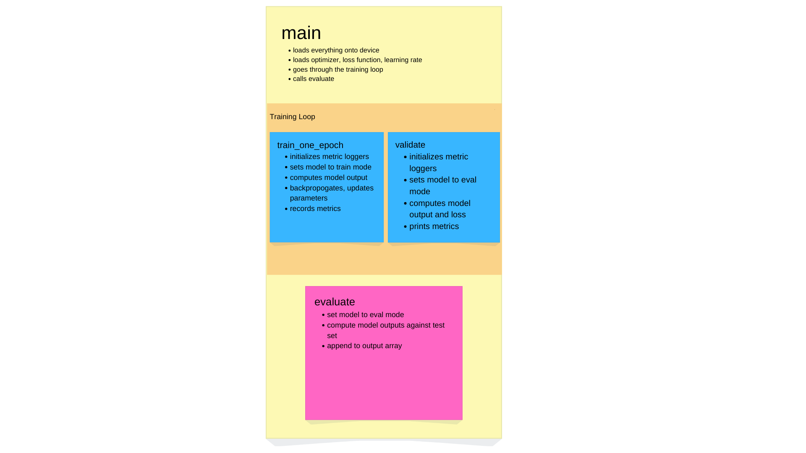
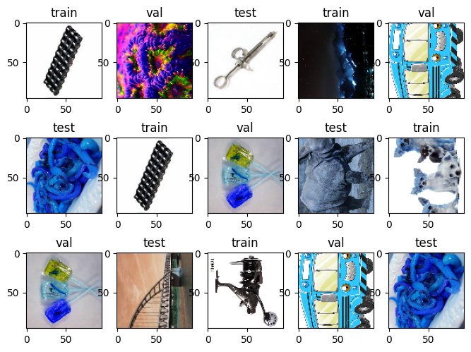
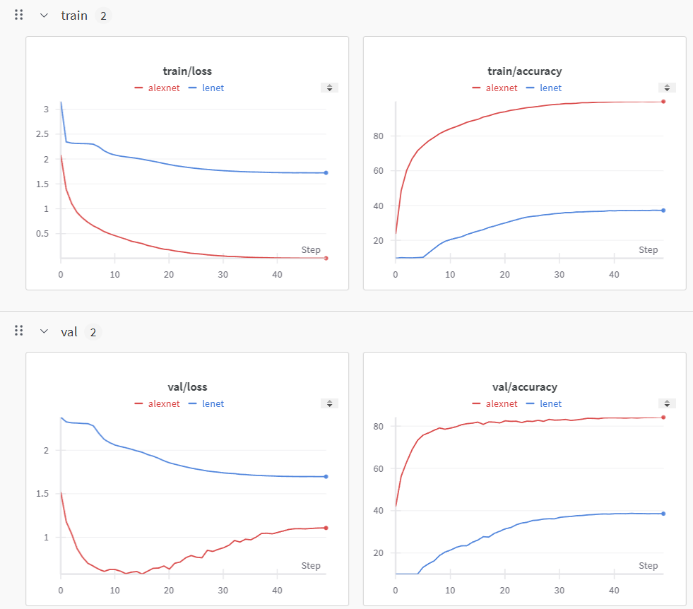
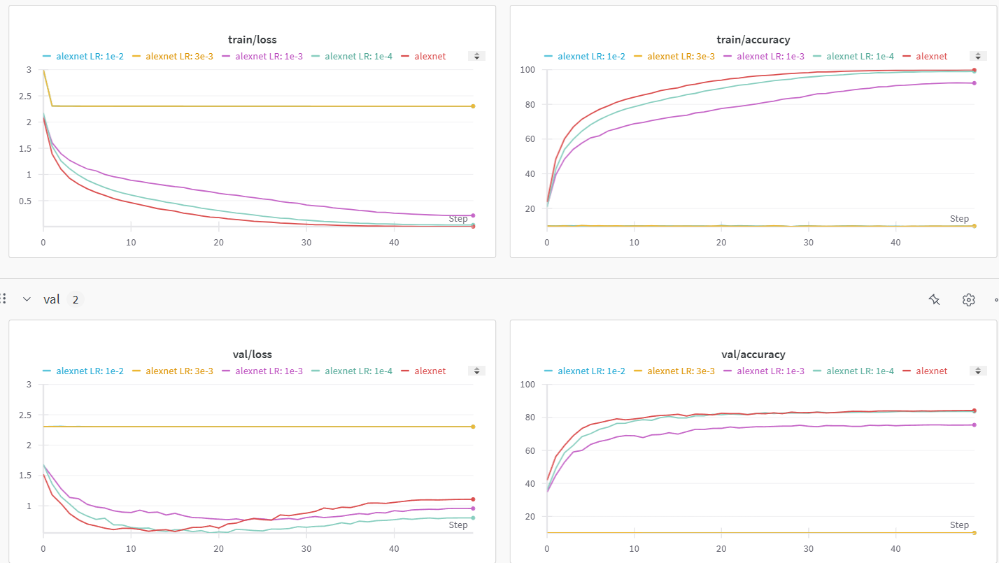
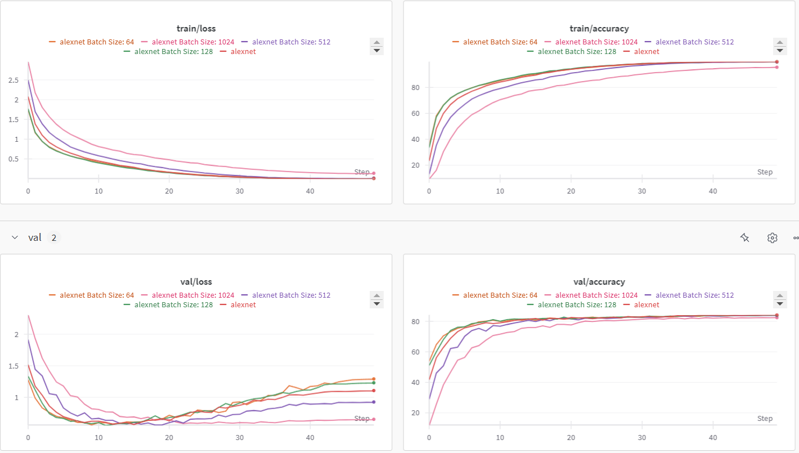

# HW 1 Worksheet

---

This is the worksheet for Homework 1. Your deliverables for this homework are:

- [ ] This worksheet with all answers filled in. If you include plots/images, be sure to include all the required files. Alternatively, you can export it as a PDF and it will be self-sufficient.
- [ ] Kaggle submission and writeup (details below)
- [ ] Github repo with all of your code! You need to either fork it or just copy the code over to your repo. A simple way of doing this is provided below. Include the link to your repo below. If you would like to make the repo private, please dm us and we'll send you the GitHub usernames to add as collaborators.

`YOUR GITHUB REPO HERE (or notice that you DMed us to share a private repo)`
https://github.com/lordkilgore/NMEP-HW3


# Part -1: PyTorch review

Feel free to ask your NMEP friends if you don't know!

## -1.0 What is the difference between `torch.nn.Module` and `torch.nn.functional`?

*`torch.nn.Module` is used to create and design the architecture of a model and `torch.nn.functional` provides a variety of functions
needed to do so.*

## -1.1 What is the difference between a Dataset and a DataLoader?

*A dataset is the raw, bulk of data and a dataloader provides an iterable wrapper over it, allowing lazy batching along with 
several other functionalities.*

## -1.2 What does `@torch.no_grad()` above a function header do?

*The `@torch.no_grad()` header decorating a function prevents Pytorch from computing any gradients within that function. As a side effect, this also prevents the construction of a computational graph.*


# Part 0: Understanding the codebase

Read through `README.md` and follow the steps to understand how the repo is structured.

## 0.0 What are the `build.py` files? Why do we have them?

*Each `build.py` file builds a model and data loaders using predefined config files in the `./configs` folder. These allow us to write code without worrying about dependency conflicts.*

## 0.1 Where would you define a new model?

*A new model is defined in the `./models` folder.*

## 0.2 How would you add support for a new dataset? What files would you need to change?

*You can add support for a new dataset by creating a `Dataset` subclass specific to the desired dataset in `./data/datasets.py`. This would additionally require you to specify another condition for which you would instantiate the datasets/dataloaders in `./data/build.py` (i.e. create train/val/test datasets and their associated dataloaders).*

## 0.3 Where is the actual training code?

*The actual training code is in `./main.py`*

## 0.4 Create a diagram explaining the structure of `main.py` and the entire code repo.



### main
- Loads everything onto device.
Initializes the logger. 
Loads optimizer, loss function, learning rate scheduler.

- Initialize loss and accuracy through an initial call to validate.

- **Loop**:
  Call `train_one_epoch`.
  Validate using `validate`.
  Save checkpoint if every so often.
  Compute training statistics.
  Update scheduler.
  Log statistics.

- Output recorded data and call `evaluate` on the test set.

### train_one_epoch
- Initializes metric loggers, sets model in training mode.
- **Loop**:
  Compute model output, then compute loss, backpropogate, optimize, print metrics.

### validate
- Initializes metric loggers, sets model in evaluation mode.
- **Loop**: 
  Compute model output, then compute loss, print metrics.

### evaluate
- Set model in evaluation mode.
- **Loop**:
  Compute model outputs, append to an output array.


# Part 1: Datasets

The following questions relate to `data/build.py` and `data/datasets.py`.

## 1.0 Builder/General


### 1.0.0 What does `build_loader` do?
*Constructs dataset splits and builds dataloaders specific to certain datasets. Returns split datasets and dataloaders.*


### 1.0.1 What functions do you need to implement for a PyTorch Datset? (hint there are 3)

*The three functions you need for a PyTorch Dataset are `__getitem__`, `__len__`, and `__init__`.*

## 1.1 CIFAR10Dataset

### 1.1.0 Go through the constructor. What field actually contains the data? Do we need to download it ahead of time?

*The `dataset` attribute contains the data, and the dataset it points to must be downloaded ahead of time.*

### 1.1.1 What is `self.train`? What is `self.transform`?

*`self.train` is a boolean which specifies whether or not the data belongs to the training set. If it is true, a sequence of transformations are applied to it (data augmentation). `self.transform` calls the `_get_transforms` method, which first constructs a sequence of transforms, then composes it into a single transform, and then the result is bound to the `self.transform` attribute.*

### 1.1.2 What does `__getitem__` do? What is `index`?

*Retrieves a single image, label pair, specified at `index` (assuming there is some natural order to the dataset), but only after applying `self.transform` to the image.*

### 1.1.3 What does `__len__` do?

*Returns the size of the dataset.*

### 1.1.4 What does `self._get_transforms` do? Why is there an if statement?

*As mentioned before, this method first constructs a sequence of transforms, then composes it into a single transform. The if statement is there to segregate the training set, which is artifically generated through data augmentation, and the validation and testing datasets (see `.\data\build.py`).*

### 1.1.5 What does `transforms.Normalize` do? What do the parameters mean? (hint: take a look here: https://pytorch.org/vision/main/generated/torchvision.transforms.Normalize.html)

*It looks like the color channels are being standardized, i.e. each channel is demeaned and scaled appropriately so that the data is uniform about the origin.*

## 1.2 MediumImagenetHDF5Dataset

### 1.2.0 Go through the constructor. What field actually contains the data? Where is the data actually stored on honeydew? What other files are stored in that folder on honeydew? How large are they?

*The field that contains the data is `self.file`. The data is stored on a `.hdf5` file in `//honey/nmep/`. The following files are stored in this directory:*
- `database.db` (0.946 GB)
- `downloader.py` (2150 bytes)
- `medium-imagenet-96.hdf5` (20.99 GB)
- `medium-imagenet.tgz` (126.6 GB)
- `test_labels_kaggle.csv` (0.85845 MB)

> *Some background*: HDF5 is a file format that stores data in a hierarchical structure. It is similar to a python dictionary. The files are binary and are generally really efficient to use. Additionally, `h5py.File()` does not actually read the entire file contents into memory. Instead, it only reads the data when you access it (as in `__getitem__`). You can learn more about [hdf5 here](https://portal.hdfgroup.org/display/HDF5/HDF5) and [h5py here](https://www.h5py.org/).

### 1.2.1 How is `_get_transforms` different from the one in CIFAR10Dataset?
*Similarly, a transform is being built, however the component transformations are different. Here, the color channels are being scaled down to the interval [0, 1]. Then, it looks like the same transforms in the CIFAR dataset class are applied in reverse: first the normalization occurs, then the resizing, followed lastly by the horizontal flip and color jittering.*

### 1.2.2 How is `__getitem__` different from the one in CIFAR10Dataset? How many data splits do we have now? Is it different from CIFAR10? Do we have labels/annotations for the test set?
*In this method, like in CIFAR, we are retrieving an image and applying a transform to it from the dataset. However, here, there is a distinction between the labels in training/validation data and testing data. If the data is part of a test split, it is given the label `-1` (i.e. no label is given to test datapoints), otherwise it is given the corresponding ground truth label in the dataset. In this case, we have 3 splits, which is different than in CIFAR, which only has 2 (`train` or `not train`).*

### 1.2.3 Visualizing the dataset

Visualize ~10 or so examples from the dataset. There's many ways to do it - you can make a separate little script that loads the datasets and displays some images, or you can update the existing code to display the images where it's already easy to load them. In either case, you can use use `matplotlib` or `PIL` or `opencv` to display/save the images. Alternatively you can also use `torchvision.utils.make_grid` to display multiple images at once and use `torchvision.utils.save_image` to save the images to disk.

Be sure to also get the class names. You might notice that we don't have them loaded anywhere in the repo - feel free to fix it or just hack it together for now, the class names are in a file in the same folder as the hdf5 dataset.

See `.\data\data_vis.ipynb` for code.





# Part 2: Models

The following questions relate to `models/build.py` and `models/models.py`.

## What models are implemented for you?

*LeNet and ResNet are implemented for us.*

## What do PyTorch models inherit from? What functions do we need to implement for a PyTorch Model? (hint there are 2)

*The models inherit from `nn.Module`. The functions we need to implement are `__init__` and forward.*

## How many layers does our implementation of LeNet have? How many parameters does it have? (hint: to count the number of parameters, you might want to run the code)

*There are 7 layers (2 convolutions, 2 pooling, 3 classification). 99276 parameters... don't ask how we got this.*

Ok here's how we got it.
`sdfj = LeNet()`
`print(sum([x.numel() for x in list(sdfj.parameters())]))`


# Part 3: Training

The following questions relate to `main.py`, and the configs in `configs/`.

## 3.0 What configs have we provided for you? What models and datasets do they train on?

*The configs provided are for LeNet (on CIFAR) and ResNet (on CIFAR and MediumImageNet).*

## 3.1 Open `main.py` and go through `main()`. In bullet points, explain what the function does.

*Explained on diagram*

## 3.2 Go through `validate()` and `evaluate()`. What do they do? How are they different? 
> Could we have done better by reusing code? Yes. Yes we could have but we didn't... sorry...

*Explained on diagram. Validation occurs during each epoch to serve as a checkpoint. Evaluation occurs after the training loop on the test set.*


# Part 4: AlexNet

## Implement AlexNet. Feel free to use the provided LeNet as a template. For convenience, here are the parameters for AlexNet:

```
Input NxNx3 # For CIFAR 10, you can set img_size to 70
Conv 11x11, 64 filters, stride 4, padding 2
MaxPool 3x3, stride 2
Conv 5x5, 192 filters, padding 2
MaxPool 3x3, stride 2
Conv 3x3, 384 filters, padding 1
Conv 3x3, 256 filters, padding 1
Conv 3x3, 256 filters, padding 1
MaxPool 3x3, stride 2
nn.AdaptiveAvgPool2d((6, 6)) # https://pytorch.org/docs/stable/generated/torch.nn.AdaptiveAvgPool2d.html
flatten into a vector of length x # what is x?
Dropout 0.5
Linear with 4096 output units
Dropout 0.5
Linear with 4096 output units
Linear with num_classes output units
```

> ReLU activation after every Conv and Linear layer. DO **NOT** Forget to add activatioons after every layer. Do not apply activation after the last layer.

## 4.1 How many parameters does AlexNet have? How does it compare to LeNet? With the same batch size, how much memory do LeNet and AlexNet take up while training? 
> (hint: use `gpuststat`)

*AlexNet has 57.8 million parameters, which is ALOT more than LeNet (99280 parameters). With the same batch size, LeNet takes up 280MB and AlexNet takes up 2454MB.*

## 4.2 Train AlexNet on CIFAR10. What accuracy do you get?

Report training and validation accuracy on AlexNet and LeNet. Report hyperparameters for both models (learning rate, batch size, optimizer, etc.). We get ~77% validation with AlexNet.

> You can just copy the config file, don't need to write it all out again.
> Also no need to tune the models much, you'll do it in the next part.

**Alexnet**  
`AUG:  
COLOR_JITTER: 0.4  
DATA:  
BATCH_SIZE: 256  
DATASET: "cifar10"  
IMG_SIZE: 32  
NUM_WORKERS: 32  
PIN_MEMORY: True  
MODEL:  
NAME: alexnet  
NUM_CLASSES: 200  
DROP_RATE: 0.0  
TRAIN:  
EPOCHS: 50  
WARMUP_EPOCHS: 10  
LR: 3e-4  
MIN_LR: 3e-5  
WARMUP_LR: 3e-5  
LR_SCHEDULER:  
  NAME: "cosine"  
OPTIMIZER:  
  NAME: "adamw"  
  EPS: 1e-8  
  BETAS: (0.9, 0.999)  
  MOMENTUM: 0.9  
OUTPUT: "output/alexnet_cifar"  
SAVE_FREQ: 5  
PRINT_FREQ: 99999  
PRINT_FREQ: 99999`  
*Train Accuracy: 99.8%*. *Validation Accuracy: 84.1%*

**LeNet**  
`AUG:
COLOR_JITTER: 0.4
DATA:
BATCH_SIZE: 256
DATASET: "cifar10"
IMG_SIZE: 32
NUM_WORKERS: 32
PIN_MEMORY: True
MODEL:
NAME: lenet
NUM_CLASSES: 200
DROP_RATE: 0.0
TRAIN:
EPOCHS: 50
WARMUP_EPOCHS: 10
LR: 3e-4
MIN_LR: 3e-5
WARMUP_LR: 3e-5
LR_SCHEDULER:
  NAME: "cosine"
OPTIMIZER:
  NAME: "adamw"
  EPS: 1e-8
  BETAS: (0.9, 0.999)
  MOMENTUM: 0.9
OUTPUT: "output/lenet_cifar"
SAVE_FREQ: 5
PRINT_FREQ: 99999
PRINT_FREQ: 99999`  
*Train Accuracy: 37.2%. Validation Accuracy: 38.6%.*


# Part 5: Weights and Biases

> Parts 5 and 6 are independent. Feel free to attempt them in any order you want.

> Background on W&B. W&B is a tool for tracking experiments. You can set up experiments and track metrics, hyperparameters, and even images. It's really neat and we highly recommend it. You can learn more about it [here](https://wandb.ai/site).
> 
> For this HW you have to use W&B. The next couple parts should be fairly easy if you setup logging for configs (hyperparameters) and for loss/accuracy. For a quick tutorial on how to use it, check out [this quickstart](https://docs.wandb.ai/quickstart). We will also cover it at HW party at some point this week if you need help.

## 5.0 Setup plotting for training and validation accuracy and loss curves. Plot a point every epoch.

`PUSH YOUR CODE TO YOUR OWN GITHUB :)`

## 5.1 Plot the training and validation accuracy and loss curves for AlexNet and LeNet. Attach the plot and any observations you have below.


*AlexNet is goated.*

## 5.2 For just AlexNet, vary the learning rate by factors of 3ish or 10 (ie if it's 3e-4 also try 1e-4, 1e-3, 3e-3, etc) and plot all the loss plots on the same graph. What do you observe? What is the best learning rate? Try at least 4 different learning rates.



## 5.3 Do the same with batch size, keeping learning rate and everything else fixed. Ideally the batch size should be a power of 2, but try some odd batch sizes as well. What do you observe? Record training times and loss/accuracy plots for each batch size (should be easy with W&B). Try at least 4 different batch sizes.

**64:**  13:15
**128:** 14:22
**256:** 12:54
**512:** 11:44
**1024:** 07:37 



## 5.4 As a followup to the previous question, we're going to explore the effect of batch size on _throughput_, which is the number of images/sec that our model can process. You can find this by taking the batch size and dividing by the time per epoch. Plot the throughput for batch sizes of powers of 2, i.e. 1, 2, 4, ..., until you reach CUDA OOM. What is the largest batch size you can support? What trends do you observe, and why might this be the case?
You only need to observe the training for ~ 5 epochs to average out the noise in training times; don't train to completion for this question! We're only asking about the time taken. If you're curious for a more in-depth explanation, feel free to read [this intro](https://horace.io/brrr_intro.html). 

1    : 690s   -> 1.4e-3 images/sec  
2    : 340s   -> 5.8e-3 images/sec  
4    : 171s   -> 23.3e-3 images/sec  
8    : 152.5s -> 52.4e-3 images/sec  
16   : 85s    -> 188.2e-3 images/sec  
32   : 34.5s  -> 0.9275 images/sec  
64   : 23s    -> 2.7826 images/sec  
128  : 15s    -> 8.5333 images/sec  
256  : 13.8s  -> 18.5507 images/sec  
512  : 6.2s   -> 82.5804 images/sec  
1024 : 6.4s   -> 160.0000 images/sec  
2048 : 8s     -> 256.0000 images/sec  
4096 : 9s     -> 455.1111 images/sec  

*OOM @ 8192 Batch Size. It appears that the time for each
epoch gets faster up until a point (~512 batch size), when
it suddenly becomes slower again. This is really weird to
me, I have no idea what is causing this.*

## 5.5 Try different data augmentations. Take a look [here](https://pytorch.org/vision/stable/transforms.html) for torchvision augmentations. Try at least 2 new augmentation schemes. Record loss/accuracy curves and best accuracies on validation/train set.

`YOUR ANSWER HERE`

## 5.6 (optional) Play around with more hyperparameters. I recommend playing around with the optimizer (Adam, SGD, RMSProp, etc), learning rate scheduler (constant, StepLR, ReduceLROnPlateau, etc), weight decay, dropout, activation functions (ReLU, Leaky ReLU, GELU, Swish, etc), etc.


# Part 6: ResNet

## 6.0 Implement and train ResNet18

In `models/*`, we provided some skelly/guiding comments to implement ResNet. Implement it and train it on CIFAR10. Report training and validation curves, hyperparameters, best validation accuracy, and training time as compared to AlexNet. 

`YOUR ANSWER HERE`

## 6.1 (optional) Visualize examples

Visualize a couple of the predictions on the validation set (20 or so). Be sure to include the ground truth label and the predicted label. You can use `wandb.log()` to log images or also just save them to disc any way you think is easy.

`YOUR ANSWER HERE`


# Part 7: Kaggle submission

To make this more fun, we have scraped an entire new dataset for you! 🎉

We called it MediumImageNet. It contains 1.5M training images, and 190k images for validation and test each. There are 200 classes distributed approximately evenly. The images are available in 224x224 and 96x96 in hdf5 files. The test set labels are not provided :). 

The dataset is downloaded onto honeydew at `/data/medium-imagenet`. Feel free to play around with the files and learn more about the dataset.

For the kaggle competition, you need to train on the 1.5M training images and submit predictions on the 190k test images. You may validate on the validation set but you may not use is as a training set to get better accuracy (aka don't backprop on it). The test set labels are not provided. You can submit up to 10 times a day (hint: that's a lot).

Your Kaggle scores should approximately match your validation scores. If they do not, something is wrong.

(Soon) when you run the training script, it will output a file called `submission.csv`. This is the file you need to submit to Kaggle. You're required to submit at least once. 

## Kaggle writeup

We don't expect anything fancy here. Just a brief summary of what you did, what worked, what didn't, and what you learned. If you want to include any plots, feel free to do so. That's brownie points. Feel free to write it below or attach it in a separate file.

**REQUIREMENT**: Everyone in your group must be able to explain what you did! Even if one person carries (I know, it happens) everyone must still be able to explain what's going on!

Now go play with the models and have some competitive fun! 🎉
